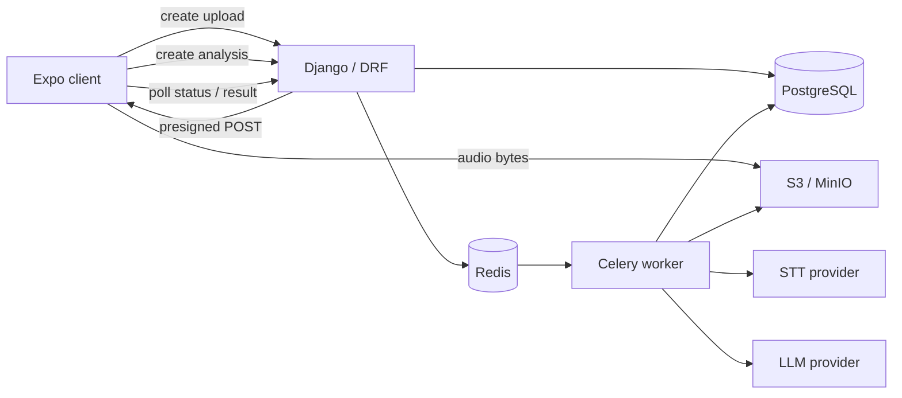

# Voice Analytics AI

Voice Analytics AI accepts an audio recording, transcribes it, runs a general structured analysis, and can run a second user-configurable analysis when its filter matches the first result.

The same application code supports cloud providers and a fully local mode with faster-whisper and Ollama.

This is an independent portfolio project focused on the backend engineering around long-running AI workloads: durable workflow state, asynchronous execution, object-storage boundaries, concurrency, recovery, structured model output and provider isolation. It is not presented as a live production service; the AWS configuration is reference infrastructure and the reproducible local/offline path is the primary way to run it.

## Architecture



The processing flow is explicitly orchestrated rather than agent-driven:

```text
upload
  -> transcription
  -> standard structured analysis
  -> deterministic template selection
  -> optional user/template analysis
  -> persisted result
```

State transitions, filter evaluation, schema validation, retry policy, and persistence are deterministic. LLM inference is not assumed to be deterministic, even with temperature set to zero.

The API and worker use the same backend image with different entry points. PostgreSQL owns durable job state; Redis only transports Celery messages.

## Design notes

The main choices are direct-to-object-storage upload, PostgreSQL as canonical job state, short Celery stages, narrow STT/LLM provider boundaries, application-side schema validation, and polling from the client.

The trade-offs are documented in [docs/design-decisions.md](docs/design-decisions.md). Runtime mechanics and failure windows are covered in [docs/architecture.md](docs/architecture.md) and [docs/failure-model.md](docs/failure-model.md).

## Quick start

Requirements: Docker with Compose v2, GNU make, and Python 3. The bundled synthetic demo also needs `ffmpeg` and either `espeak-ng` or `espeak`; alternatively pass your own audio file to `scripts/demo.py`.

```bash
cp .env.example .env
make models
make offline-up
make demo
```

The first model download needs network access. Once the models and images are present, the local AI path does not call an external AI API.

The demo uses synthetic speech and exercises the same upload/status/result API as the mobile client.

### Mobile client

```bash
cd mobile
npm ci
EXPO_PUBLIC_API_URL=http://localhost:8000 \
EXPO_PUBLIC_API_TOKEN=$(make -s -C .. demo-user) \
npx expo start
```

For a physical device, expose the API and MinIO endpoints on an address reachable from the phone. The client contains no backend business rules: it selects a file, uploads it through the presigned form, creates an analysis, polls status, and renders the result.

## API

All application endpoints use token authentication.

| Method | Path | Purpose |
|---|---|---|
| POST | `/api/v1/uploads` | Create an upload slot and receive a presigned POST |
| POST | `/api/v1/uploads/{id}/complete` | Verify the stored object and mark the upload ready |
| GET | `/api/v1/uploads/{id}` | Read upload metadata |
| DELETE | `/api/v1/uploads/{id}` | Remove the upload and derived customer data |
| POST | `/api/v1/analyses` | Create an asynchronous analysis |
| GET | `/api/v1/analyses/{id}` | Read processing status |
| GET | `/api/v1/analyses/{id}/result` | Read the completed result |
| DELETE | `/api/v1/analyses/{id}` | Delete analysis data while keeping the audio |
| GET/POST | `/api/v1/prompt-templates` | List available templates or create a user template |
| GET/DELETE | `/api/v1/prompt-templates/{id}` | Read or deactivate a user template |
| GET/POST | `/api/v1/prompt-templates/{id}/versions` | Read version history or create a new immutable version |

Health endpoints are available at `/health/live` and `/health/ready`.

## User-configurable second analysis

Every job first produces the application-defined standard result: summary, topics, sentiment, speaker count, action items, and key points.

The second analysis is controlled by a `PromptTemplate`. Built-in Sales and Support templates are included, and authenticated users can create their own templates through the API.

Example:

```json
{
  "name": "Renewal review",
  "slug": "renewal-review",
  "priority": 100,
  "analysis_type": "renewal_review",
  "analysis_instructions": "Extract renewal risks, commercial blockers and agreed next actions.",
  "filter_config": {
    "topics_contains_any": ["renewal", "contract"]
  },
  "output_schema": {
    "fields": {
      "renewal_risks": "Risks that may prevent renewal",
      "commercial_blockers": "Pricing or contractual blockers",
      "next_actions": "Explicitly agreed next actions"
    }
  }
}
```

Filters use a closed declarative vocabulary: language, allowed languages, sentiment, topic matches, minimum speaker count, and presence of action items. There is no expression language and no `eval`.

User-owned templates are evaluated before built-ins. Matching within a scope is ordered by priority and slug, so the same standard result and template set produce the same selection.

Template content is immutable once created. Changes create a new version; every result records the exact template version, provider, model, latency, and usage metadata.

User-authored analysis instructions never become system instructions. Fixed application rules and the output contract stay in the system role; the user's request is a separate user-role message, and the transcript is separately marked as untrusted data.

## Reliability

Celery delivery is at least once. Each analysis stage acquires a short PostgreSQL execution lease, releases the transaction before storage or provider I/O, and persists only while the same claim still owns the stage. Celery beat republishes recoverable stalled work after lease expiry.

Upload completion uses the same ownership pattern around the verified staging-to-final object copy. External provider invocation is intentionally not claimed to be exactly once: a worker crash after a provider response but before persistence can repeat that call.

## Offline mode

```bash
make models
make offline-up
make demo
```

Local providers:

- speech-to-text: faster-whisper;
- structured analysis: Ollama;
- storage: MinIO;
- database: PostgreSQL;
- broker: Redis.

The offline Compose overlay isolates the worker and Ollama from external network access after model preparation. Model names remain configuration, not domain dependencies.

## AWS deployment reference

Terraform under `infrastructure/terraform` defines a production-shaped AWS deployment using ECS Fargate API/worker/beat services, RDS PostgreSQL, ElastiCache Redis, S3, Secrets Manager, an ALB, IAM roles and CloudWatch.

The Terraform is retained as infrastructure design and is validated in CI. No live AWS environment is required to run or evaluate the project.

## Known limitations

- No speaker diarization; speaker count is inferred from transcript text.
- Long transcripts are truncated at `TRANSCRIPT_MAX_CHARS`; multi-hour recordings need chunking and hierarchical analysis.
- The OpenAI transcription adapter rejects files above the provider's single-request limit rather than chunking them.
- The current mobile UI does not manage prompt templates; template management is exposed through the authenticated API.
- Token authentication is adequate for this service skeleton but a real consumer product needs login, token rotation, account recovery, and tenant policy.
- Worker autoscaling is not yet driven by queue depth.
- Terraform is validated in CI but cloud resources are not provisioned by CI.

## Development

```bash
make setup
make test
make lint
make typecheck
make mobile-check
make terraform-validate
```

CI runs backend formatting, linting, type checks, migration checks, and tests against PostgreSQL. It also runs mobile lint/typecheck/tests, validates Terraform and Compose files, and builds the backend image.

## Repository history

This repository is a curated portfolio snapshot. Development work was consolidated before publication, so the small commit history does not represent the original implementation chronology.

## License

Licensed under the [Apache License 2.0](LICENSE).
