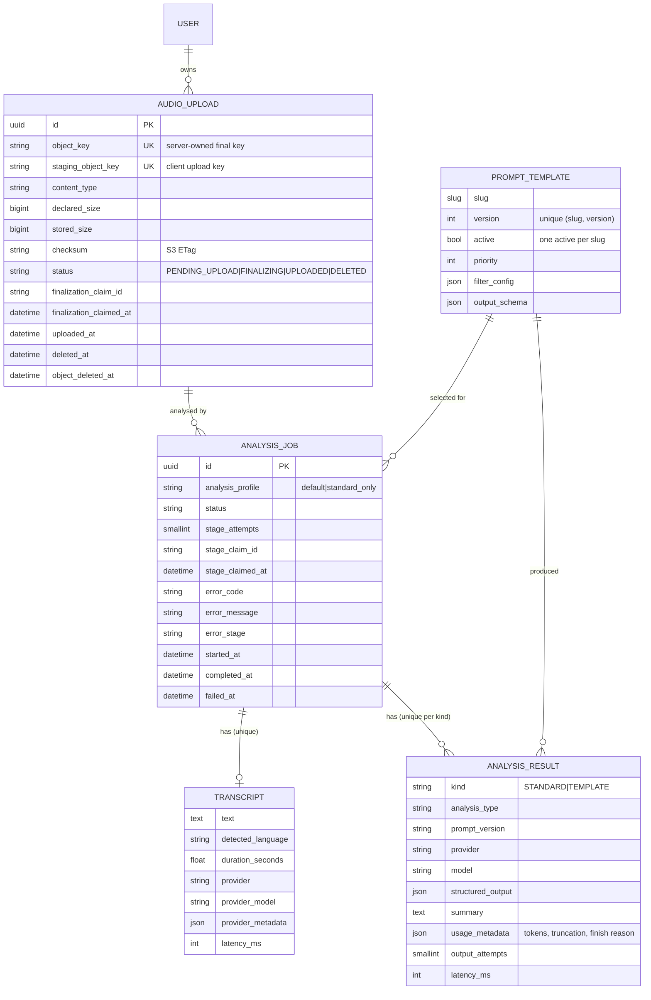

# Architecture

## Runtime components

| Component | Tech | Responsibility |
|---|---|---|
| API | Django 5.2 + DRF under gunicorn | Auth, validation, upload slots, job creation, status and result reads, deletion. Never touches audio bytes or AI providers. |
| Worker | Celery 5 (same image) | Runs the three pipeline stages and storage-cleanup tasks. |
| Scheduler | Celery beat (same image) | Periodically republishes stalled jobs and expires/retries upload cleanup. |
| PostgreSQL | 17 | Canonical state: uploads, jobs, transcripts, results, templates. |
| Redis | 7 | Celery broker only. There is no result backend (`CELERY_RESULT_BACKEND = None`). |
| Object storage | S3 (AWS) / MinIO (local) | Client-writable staging plus server-owned finalized audio. Workers read only finalized objects. |
| STT | faster-whisper (in the worker process) or OpenAI | Speech-to-text behind `TranscriptionProvider`. |
| LLM | Ollama or an OpenAI-compatible API | Structured analysis behind `LLMProvider`. |
| Client | Expo / React Native / TypeScript | Upload, polling, result display. |

## Code layout

```
backend/
  config/            settings (env-driven), celery app + request-id propagation, urls
  apps/common/       error model, JSON logging + context, request-id + health middleware, API error envelope
  apps/uploads/      AudioUpload, S3 wrapper (presign / head / download / delete), upload services + API, cleanup task
  apps/prompts/      PromptTemplate (immutable versions), filter vocabulary, output spec, prompt builder, template selection
  apps/analyses/     AnalysisJob / Transcript / AnalysisResult, state machine, pipeline stages, Celery tasks,
                     providers (transcription.py, llm.py), Pydantic schemas, pricing, API
  tests/             pytest: API, pipeline, state machine, templates, provider contracts, live-model tests
mobile/
  app/               expo-router screens: index (upload), analysis/[id] (status), analysis/[id]/result
  src/               typed API client, presigned upload, polling hook, UI primitives
infrastructure/terraform/   VPC, ALB, ECS, RDS, ElastiCache, S3, Secrets Manager, IAM, CloudWatch
scripts/             demo client and sample-audio generator (fixture is generated on demand)
```

Dependency direction: `analyses` → `prompts` → `analyses.schemas`, and `analyses` →
`uploads` → `common`. The pipeline module ([pipeline.py](../backend/apps/analyses/pipeline.py))
holds the business steps. [tasks.py](../backend/apps/analyses/tasks.py) only adds Celery
concerns: retry policy, time limits and next-stage routing.

## Data model



Constraints that carry correctness:

| Constraint | Protects against |
|---|---|
| `Transcript.analysis_job` one-to-one | Duplicate transcription after redelivery or a race. |
| `AnalysisResult (analysis_job, kind)` unique | Duplicate standard or template results. |
| `AnalysisResult` check: `kind=TEMPLATE ⇔ prompt_template IS NOT NULL` | Results without provenance. |
| `AnalysisJob (audio_upload, analysis_profile)` unique where `status <> 'FAILED'` | Double-submitted "Analyse" taps paying twice. |
| `PromptTemplate (slug, version)` unique; one `active` per slug | Ambiguous template selection. |
| `AudioUpload.object_key` unique | Two uploads sharing an object. |

`current_stage` is derived from `status` (plus `error_stage` for failures) instead of
being stored, so the two can never disagree.

## Transaction boundaries

The rule is **no transaction is ever open during network I/O to S3, STT or the LLM.**

```
claim    BEGIN; SELECT … FOR UPDATE; transition/acquire execution lease; COMMIT        (~ms)
work     download finalized audio; call provider; validate output                       (s–min)
persist  BEGIN; SELECT … FOR UPDATE; same stage + claim id? persist + transition; COMMIT (~ms)
```

Row locks are held for milliseconds and only on the one job row. A different duplicate
delivery that finds a live execution lease exits before provider I/O and does not consume
another stage attempt. Persistence verifies the lease identity, so an old worker cannot
persist after ownership has moved.

The unavoidable window: the external call succeeded, but the worker died before persist
committed. The redelivered message pays for the call again. Nothing is duplicated in the
DB, and cost is bounded by `PIPELINE_MAX_STAGE_ATTEMPTS`. See [failure-model.md](failure-model.md).

## Upload flow

```text
POST /uploads
  -> allocate staging/{user}/{upload}/source.ext and audio/{user}/{upload}/source.ext
  -> return presigned POST for staging only, constrained to exact declared bytes

client -> staging object

POST /uploads/{id}/complete
  -> lock row briefly and acquire FINALIZING lease
  -> HEAD staging and verify size/type
  -> renew lease immediately before the conditional server-side COPY to audio/
  -> HEAD finalized audio
  -> lock row briefly; persist only if the same finalization claim still owns the row

worker -> downloads audio/ only
```

The client never receives write credentials for the finalized key. Reusing a still-valid
signed POST can therefore replace staging data after completion without changing the
object processed by workers. A live finalization lease also serializes competing
`/complete` requests and fences deletion/expiry before COPY. Periodic maintenance removes
expired staging objects; the AWS bucket also has a lifecycle expiry for the staging prefix.

## Deletion

`DELETE /uploads/{id}` works in order:

1. In one transaction: lock the upload, hard-delete its jobs (transcripts and results
   cascade), and mark the upload `DELETED` with `deleted_at`.
2. If a finalizer owns a live lease, keep that claim on the tombstone so storage cleanup
   cannot declare the permanent object gone while COPY is still allowed to run.
3. After commit, best-effort enqueue `delete_upload_object`. If Redis publication fails,
   the committed DELETE still returns success.
4. A finalizer that observes the tombstone after COPY removes its own late write. Celery
   beat periodically republishes cleanup for tombstones and removes staging again after
   the signed upload URL has expired. `manage.py purge_deleted_objects` remains a manual
   repair tool.

The DB becomes consistent first, so the API never serves data for a deleted upload. A
lost cleanup task leaves an orphaned object, which the sweep finds. The reverse order
could not be recovered: deleting S3 first and then crashing would leave DB rows pointing
at nothing. A stage running during deletion finds no job at persist time and drops its output.
Analysis creation takes the same upload-row lock as deletion, so it cannot create durable
job metadata from a stale pre-delete upload instance.

`DELETE /analyses/{id}` deletes one job and its derived data and keeps the audio.

## Observability

- **Logs.** One JSON object per line with `request_id`, `job_id`, `upload_id`, `stage`,
  `provider`, `model`, `attempt`, `duration_ms` and `error_code`, bound through context
  variables. The API's `X-Request-ID` travels in the Celery message headers, so worker
  lines carry the request id of the HTTP call that created the job.
- **Metrics.** CloudWatch Logs metric filters turn those lines into `JobsCreated`,
  `JobsCompleted`, `JobsFailed{ErrorCode}`, `StageLatencyMs{Stage,Model}`,
  `LLMOutputTokens{Model}` and `StageRetries{ErrorCode}`, with no metrics library in the
  app. Queue depth (Redis `LLEN celery`) needs a small publisher; this is documented,
  not implemented.
- **Health.** `/health/live` returns 200 while the process serves. `/health/ready` checks
  the DB (`SELECT 1`), Redis (`PING`) and the bucket (`HEAD`) with short timeouts. AI
  providers are deliberately excluded: a provider outage should fail jobs, not take the
  API out of rotation.
- **Cost.** Every transcript and result stores provider, model, usage and latency.
  [pricing.py](../backend/apps/analyses/pricing.py) is the only place prices live.
  `estimate_analysis_cost(result)` returns a `Decimal` or `None`. Local inference is
  reported with basis `local_compute`.
