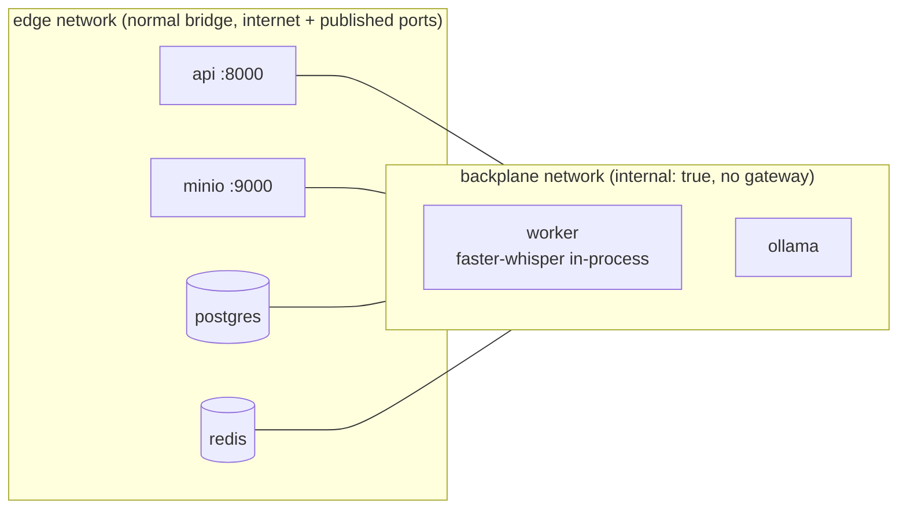

# Offline mode

**Definition:** once the models have been downloaded, processing an audio file makes no
call to any external service. Docker networking enforces this, not just configuration.

## How it is enforced



[docker-compose.offline.yml](../docker-compose.offline.yml) sets:

- `worker.networks: !override [backplane]`. The worker is attached only to the internal
  network. It can reach Postgres, Redis, MinIO and Ollama, and nothing else.
- `ollama` is attached only to `backplane`.
- `STT_PROVIDER=whisper_local`, `LLM_PROVIDER=ollama`, `OLLAMA_BASE_URL=http://ollama:11434`
  and `HF_HUB_OFFLINE=1`. A missing Whisper model is then a
  `PROVIDER_CONFIGURATION_ERROR`, not a silent download.

Check from inside the running worker (output from the verification run):

```
BLOCKED   https://api.openai.com/v1/models -> URLError [Errno -3] Temporary failure in name resolution
BLOCKED   https://huggingface.co -> URLError [Errno -3] Temporary failure in name resolution
BLOCKED   http://1.1.1.1 -> URLError [Errno 101] Network is unreachable
ollama    {"models":[{"name":"qwen2.5:3b-instruct", …
minio     200
```

To reproduce: `docker compose -f docker-compose.yml -f docker-compose.offline.yml exec worker python -c "import urllib.request; urllib.request.urlopen('https://api.openai.com', timeout=5)"`
should fail.

The API and MinIO stay on the `edge` network because the client (laptop or phone) must
reach them. They never call AI providers.

## Steps

```bash
cp .env.example .env
make models        # needs internet, once
make offline-up    # from here on, no internet needed
make demo
```

`make models` does two things:

1. `docker compose run --rm --no-deps worker python manage.py download_whisper_model`
   downloads `STT_MODEL` (default `base`, ~145 MB) into the `whisper-models` volume
   (`HF_HOME=/models/huggingface`). This uses the base Compose file, where the worker
   still has internet access.
2. The one-off `ollama-pull` service (profile `models`, on the `edge` network) runs
   `ollama pull $LLM_MODEL` (default `qwen2.5:3b-instruct`, ~1.9 GB) into the
   `ollama-models` volume. The offline `ollama` service mounts the same volume.

On a fully air-gapped machine, copy the two volumes (or `~/.ollama` and the HF cache)
from a connected machine. The Docker images must also be present (`docker save` /
`docker load`).

## Model choice

| | Default | Why | Upgrade |
|---|---|---|---|
| STT | faster-whisper `base`, int8, CPU | 43s of audio transcribes in about 9s on 8 CPU cores; multilingual | `STT_MODEL=small` (better names and accents), `medium`, `large-v3` (GPU: `WHISPER_DEVICE=cuda WHISPER_COMPUTE_TYPE=float16`) |
| LLM | `qwen2.5:3b-instruct` | ~2 GB, runs on CPU in ~8 GB RAM, good JSON adherence with constrained decoding | `LLM_MODEL=qwen2.5:7b-instruct` (verified with the live test), `llama3.1:8b`, any Ollama model |

Nothing in business code refers to a specific model. The model name is configuration,
and it is stored with every result for provenance.

Measured on this project's reference run (CPU only, 8 cores):

| Stage | Time |
|---|---|
| Transcription (43.5s audio, Whisper base) | 8.7s |
| Standard analysis (741 in / 271 out tokens) | 90.6s |
| Sales template analysis (708 in / 136 out tokens) | 56.6s |

Quality notes from that run: the 3B model assigned both action items to "Customer" (one
belongs to the vendor) and counted 3 speakers instead of 2. Whisper `base` heard "Acme"
as "Akmitter May" in the synthetic voice. This is why the model is configurable, and why
validation checks the *shape*, never the *truth*, of model output.

## Differences from cloud mode

| | Offline | Cloud |
|---|---|---|
| STT | in-process faster-whisper (CPU/GPU in the worker) | HTTP to OpenAI (25 MB/request limit) |
| LLM | Ollama over the internal network, constrained decoding via `format` | OpenAI `response_format=json_schema` |
| Worker egress | none | NAT to the internet |
| Cost | `local_compute` (hardware) | per token / per minute, estimated per job |
| Scaling | bounded by local CPU/GPU; worker concurrency is small | bounded by provider rate limits |
| Code path | identical except the two provider classes | |

## Running offline mode in AWS

It's not provisioned. It would need GPU capacity: ECS on EC2 with GPU instances for the
worker, and Ollama or vLLM as a sidecar or separate service. Fargate has no GPUs.
